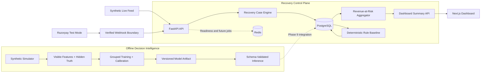
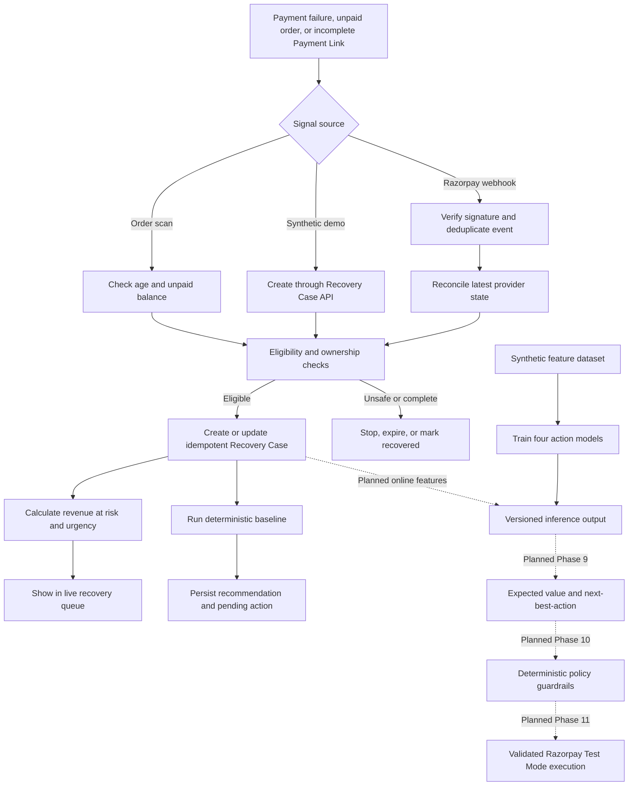
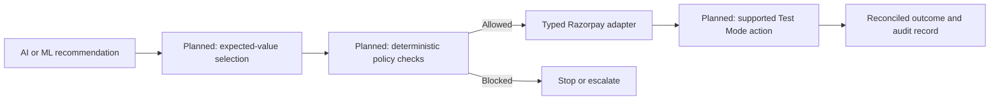

<div align="center">

# Revenue Recovery Control Plane

### Turn payment failures into prioritized, explainable recovery opportunities

An AI-assisted decision and measurement layer for Razorpay merchants, built with
FastAPI, Next.js, PostgreSQL, Redis, and calibrated machine learning.

**Razorpay Test Mode** | **Database-backed dashboard** | **Action-conditional ML** | **Auditable by design**

</div>

---

## Product Overview

Merchants can see that a payment failed, but that alone does not answer the
questions that matter:

- How much revenue is currently at risk?
- Which failures are still recoverable?
- Which cases should be handled first?
- Should the merchant send a recovery link, request a payment-method update,
  wait, or stop?
- Did an intervention create additional recovery, or would the customer have
  paid anyway?

**Revenue Recovery Control Plane** converts failed payments, unpaid orders, and
incomplete Payment Links into structured Recovery Cases. It calculates monetary
exposure, benchmarks deterministic recovery rules, and estimates recovery
probability under multiple candidate actions.

> The system treats AI output as a recommendation, never as permission to execute
> a financial action.

## Highlights

| Capability | What it provides |
| --- | --- |
| Recovery Case engine | Idempotent, merchant-scoped cases with validated lifecycle transitions |
| Revenue-at-risk dashboard | Live PostgreSQL-backed totals, opportunity ranking, and 3-second polling |
| Secure webhook ingestion | HMAC verification, deduplication, retries, and current-state reconciliation |
| Razorpay boundary | Typed, provider-neutral adapter restricted to Razorpay Test Mode |
| Rule baseline | Explainable `RECOVERY_LINK`, `DELAY`, and `STOP` recommendations |
| Synthetic simulator | Reproducible counterfactual datasets with hidden ground truth |
| Action-conditional ML | Four calibrated models estimating recovery probability by intervention |
| Evaluation and auditability | Control/treatment reports, model metrics, checksums, and append-only audit events |

## Architecture



The application is a modular monolith. Provider integration, domain logic,
analytics, experiments, and ML remain separate modules while sharing one
deployable API and one durable database.

## End-to-End Workflow



## How Recovery Works

### 1. Detect and normalize

Supported payment and Payment Link events enter through a signature-verified
webhook. The system stores each provider event once and reconciles the current
Razorpay resource state before modifying local records. Unpaid orders can also be
found by a deterministic age-and-balance scan.

### 2. Build a Recovery Case

Every eligible signal becomes one merchant-scoped Recovery Case containing its
source, amount at risk, currency, recovery window, lifecycle status, and audit
history. Duplicate signals return the existing case instead of double-counting
revenue.

### 3. Prioritize opportunity

The dashboard groups revenue at risk by currency and ranks active cases by
monetary value and recovery-window urgency. Expected recoverable value is shown
only when a valid persisted probability exists; missing estimates remain visibly
`Pending`.

### 4. Establish an explainable baseline

The versioned `rule-baseline-v1` applies these deterministic rules:

| Case condition | Recommendation | Reason |
| --- | --- | --- |
| Unpaid order | `RECOVERY_LINK` | Give the customer a supported path to complete payment |
| Existing Payment Link | `DELAY` | Avoid creating a duplicate link while the current link remains recoverable |
| Transient bank/gateway failure | `RECOVERY_LINK` | Offer a fresh supported payment path |
| Unknown or non-transient failure | `STOP` | Avoid unsafe or low-confidence automation |

### 5. Estimate action-conditional recovery

Rather than producing one generic score, Phase 8 estimates:

```text
P(recovery | no intervention)
P(recovery | recovery link)
P(recovery | payment-method update prompt)
P(recovery | delay)
```

Four gradient-boosted binary classifiers use numeric and one-hot encoded
categorical features. Three-fold sigmoid calibration makes the output more useful
for future expected-value calculations.

## ML Evaluation

Reference results use the fixed Phase 7 simulator dataset with 5,000 cases and
seed 42.

| Metric | Synthetic held-out result |
| --- | ---: |
| Deterministic rule recovery rate | 35.98% |
| Model-selected recovery rate | 46.22% |
| Absolute lift over rules | 10.24 percentage points |
| Test ROC-AUC across actions | 0.6708 - 0.7454 |
| Expected calibration error | 0.0224 - 0.0331 |
| Oracle action-selection accuracy | 86.17% |

These are reproducible **synthetic benchmark results**, not claims about
production Razorpay recovery performance.

### Leakage prevention

- Model-visible features and hidden potential outcomes are separate files.
- Manifest SHA-256 checksums and exact schemas are verified before training.
- Case, customer, and payment identifiers are excluded from model inputs.
- Train, validation, and test partitions are grouped by customer.
- Inference never reads the hidden ground-truth file.
- Automated tests reject hidden columns inserted into visible features.

## Quick Start with Docker

### Prerequisites

- Docker Desktop with Docker Compose
- PowerShell, Bash, or another terminal
- Ports `3000`, `8000`, `5432`, and `6379` available

### 1. Configure the environment

The checked-in defaults are sufficient for a local synthetic demonstration.
Create an environment file only when values need to be overridden.

PowerShell:

```powershell
Copy-Item .env.example .env
```

Bash:

```bash
cp .env.example .env
```

Keep real credentials out of Git.

### 2. Start the stack

```bash
docker compose up --build --detach
```

The API container applies all Alembic migrations before starting.

### 3. Seed the local demo merchant

The seed command is idempotent and can be run repeatedly.

```bash
docker compose exec api python -m app.db.seed
```

### 4. Verify the services

| Service | URL |
| --- | --- |
| Product dashboard | [http://localhost:3000](http://localhost:3000) |
| Interactive API docs | [http://localhost:8000/docs](http://localhost:8000/docs) |
| API health | [http://localhost:8000/health](http://localhost:8000/health) |
| Dependency readiness | [http://localhost:8000/health/ready](http://localhost:8000/health/ready) |

PowerShell readiness check:

```powershell
Invoke-RestMethod http://localhost:8000/health/ready | ConvertTo-Json -Depth 4
```

### Port overrides

PowerShell:

```powershell
$env:API_PORT="18000"
$env:WEB_PORT="13000"
$env:NEXT_PUBLIC_API_BASE_URL="http://localhost:18000"
docker compose up --build --detach
```

Bash:

```bash
API_PORT=18000 WEB_PORT=13000 \
NEXT_PUBLIC_API_BASE_URL=http://localhost:18000 \
docker compose up --build --detach
```

## Live Prototype Demo

The dashboard is not populated from frontend constants. It reads a computed API
summary backed by PostgreSQL and refreshes every three seconds. The included feed
uses labeled synthetic signals so the complete demo is safe and repeatable.

1. Open [http://localhost:3000](http://localhost:3000).
2. Keep the dashboard visible beside a PowerShell terminal.
3. Run:

```powershell
powershell -ExecutionPolicy Bypass -File scripts/demo-live-feed.ps1 `
  -Count 9 `
  -IntervalSeconds 2 `
  -RunBaseline
```

The demo will:

- create unique `ORDER`, `PAYMENT_LINK`, and `PAYMENT` Recovery Cases through the
  real API
- persist each case in PostgreSQL
- update revenue-at-risk totals and the queue within three seconds
- execute the deterministic decision baseline
- print `RECOVERY_LINK`, `DELAY`, and `STOP` action counts

No Razorpay request, customer message, or financial action is sent by this demo.
See the [complete submission and narration guide](docs/project-submission-guide.md)
for a timed presentation script and common judge questions.

## Train and Evaluate the ML Candidate

### Local Python setup

Python 3.10 or newer is recommended.

```bash
python -m venv .venv
```

PowerShell:

```powershell
.venv\Scripts\python -m pip install -r apps/api/requirements.txt
```

Bash:

```bash
.venv/bin/python -m pip install -r apps/api/requirements.txt
```

### Generate a reproducible dataset

```bash
python -m simulator \
  --cases 5000 \
  --seed 42 \
  --output-dir artifacts/simulator
```

PowerShell can run the same command on one line:

```powershell
python -m simulator --cases 5000 --seed 42 --output-dir artifacts/simulator
```

### Train the four calibrated models

```bash
python -m ml \
  --dataset-dir artifacts/simulator \
  --output-dir artifacts/model \
  --seed 42
```

Training produces:

- `model.joblib`: preprocessing and calibrated estimators
- `metadata.json`: dataset hashes, split sizes, metrics, comparison, and version

Only load joblib artifacts created by this trusted project.

### Run inference

```bash
python -m ml.inference \
  --model artifacts/model/model.joblib \
  --input artifacts/simulator/features.csv \
  --output artifacts/model/predictions.csv
```

The output contains only `case_id` and four action probabilities. Generated
artifacts are intentionally ignored by Git.

## API Surface

| Method | Endpoint | Purpose |
| --- | --- | --- |
| `GET` | `/health/ready` | Verify PostgreSQL and Redis readiness |
| `POST` | `/webhooks/razorpay` | Ingest a signed Razorpay event |
| `POST` | `/api/cases` | Create a Recovery Case for validation/demo use |
| `GET` | `/api/cases` | List Recovery Cases |
| `GET` | `/api/cases/{case_id}` | Inspect one Recovery Case |
| `PATCH` | `/api/cases/{case_id}/status` | Apply a validated lifecycle transition |
| `POST` | `/api/cases/scan-unpaid-orders` | Detect eligible unpaid orders |
| `GET` | `/api/dashboard/summary` | Compute monetary totals and top opportunities |
| `POST` | `/api/baselines/batches` | Assign a rule-baseline experiment batch |
| `GET` | `/api/baselines/{experiment_id}/report` | Compare experiment groups and actions |

### Supported Razorpay webhook events

```text
payment.failed
payment.authorized
payment.captured
payment_link.paid
payment_link.partially_paid
payment_link.cancelled
payment_link.expired
```

Unsupported but correctly signed event types are stored as `IGNORED`.

## Financial Safety Boundary



Only model training, inference, and the deterministic baseline are implemented in
the current scope. Expected-value selection, policy execution, and provider action
orchestration are deliberately shown as the next safety layers.

Additional controls include:

- live Razorpay keys rejected by default
- raw-body webhook signature verification
- current and previous webhook-secret rotation support
- merchant ownership checks
- configurable request-size and recovery-window limits
- terminal case states that cannot reopen on late events
- captured-payment evidence required for recorded recovery
- no invented generic failed-payment retry API

## Development and Testing

### Backend tests

```bash
python -m pytest -q
```

Current result: **66 tests passing**.

### Frontend production build

```bash
pnpm install
pnpm web:build
```

### Compose validation

```bash
docker compose config --quiet
```

Test coverage includes domain transitions, repositories, provider contracts,
webhook signatures and duplicates, reconciliation, Recovery Case creation,
monetary aggregation, baseline experiments, simulator reproducibility, leakage
protection, model calibration, serialization, and inference schemas.

## Project Structure

```text
apps/
  api/                  FastAPI application and domain modules
  web/                  Next.js operational dashboard
docs/                   Architecture, model, integration, and demo guides
migrations/             Alembic database migrations
ml/                     Feature loading, training, artifacts, and inference
simulator/              Reproducible synthetic counterfactual generator
scripts/                Live prototype utilities
tests/                  Cross-cutting simulator and ML tests
docker-compose.yml      Local PostgreSQL, Redis, API, and web stack
IMPLEMENTATION_PLAN.md  Phase-by-phase delivery contract
```

## Implementation Status

The repository is complete through **Phase 8: ML Recoverability / Action Model**.

Implemented:

- foundation, schema, and Recovery Case lifecycle
- Razorpay Test Mode integration boundary
- secure webhook ingestion and reconciliation
- Recovery Case engine and revenue-at-risk dashboard
- deterministic baseline and experiment reports
- synthetic counterfactual simulator
- calibrated action-conditional model training and batch inference

Planned next:

- expected-value ranking and persisted next-best-action decisions
- deterministic guardrail engine
- real Test Mode recovery execution orchestration
- incremental measurement and explanation layers
- case-investigation UI, hardening, and production-readiness work

This distinction is intentional: the prototype demonstrates recommendation and
evaluation without overstating execution capability or synthetic performance.

## Documentation

- [End-to-end submission guide](docs/project-submission-guide.md)
- [Architecture](docs/architecture.md)
- [Recovery Case engine](docs/recovery-cases.md)
- [Revenue at risk](docs/revenue-at-risk.md)
- [Rule baseline](docs/rule-baseline.md)
- [Synthetic simulator](docs/simulator.md)
- [Action-conditional model](docs/ml-model.md)
- [Razorpay adapter](docs/razorpay-adapter.md)
- [Webhook ingestion](docs/webhooks.md)
- [Phase acceptance status](docs/phase-status.md)

---

<div align="center">

Built as a safety-first recovery intelligence prototype for Razorpay Test Mode.

</div>
